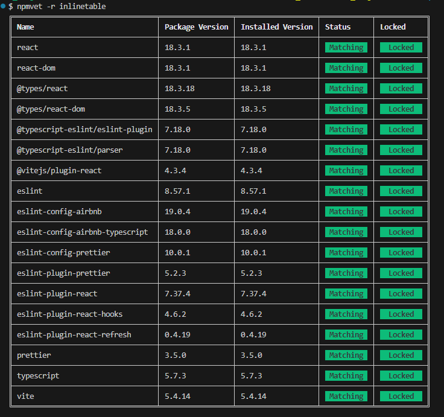

# SALONAI-FRONTEND

## Overview

This is the frontend for this project that will be used for the webApp version for now.  
A follow-up App will be soon to come which would fork this one 

*Please look at the following instrucitons bellow for those that work on the project*

## Installing Locally
```bash
npm install
npm run dev
```
* The first installs the dependencies
* The second will run the sample so you can see how it works.

## Installing NEW Dependencies

When you install a new dependency and want to save it with the exact version (to avoid the caret `^`), run:

```bash
npm install <dependency> --save --save-exact
```
### Other way of doing it
If you wish to not use the `--save --save-exact` simply run the following before you wish to install any future dependencies.
```bash
npm config set save-exact true
```
This means that you can simply stick with the `npm install...` for future, thus removing the `--save --save-exact` portion.

## Importance -- Linting
In order for this to run on other machines cleanly and have same format when reading.  
I have based everything around the Typescript Style Guild provided by Airbnb

[Airbnb Javascript Style Guide](https://github.com/airbnb/javascript?tab=readme-ov-file)

If you wish to use the linting feature do this 

```bash 
npm run lint
npm run lint:fix
```
*Don't worry if you get any errors this will take care of them*

## Rules for now before pushing you local branch to the remote repo
In order to make the `package-lock.json` to function properly you need to run the following command. 
```bash
rm npm-shrinkwrap.json
npm install
npm run dev
```
Then once everything is to your liking. Do this:
```bash
npm install npmvet -g
npmvet -r inlinetable
```
Your table should look like this in th `CI` :



### *Note*
*If you are getting Mismatch then change the dependencies that you have in your package.json with the numbers in the 3<sup>rd</sup> column*

*If you are getting Unlocked then remove the `^` at the front of every number in your package.json*

Once the table is all green and your updates are done do the following: 

```bash
npm shrinkwrap
```
shrinkwrap forces the environment to use the exact dependencies that each package needs. Thus minimizing JS and TS dependency bugs. 

## Issues
*If you are getting an error please let me know on discord and I can take a look at it and fix it*

## Files to Ignore
* node_modules
* .dist if your in vs code

# Future Updates
* For now everything is blank slate
* Lets create the chatbot endpoint 
  * *(For temp we can link is to ChatGPT)*
*  Things to look at are React-Three-Fiber, or drei
*  Three.js etc. for graphics on the UI front. 